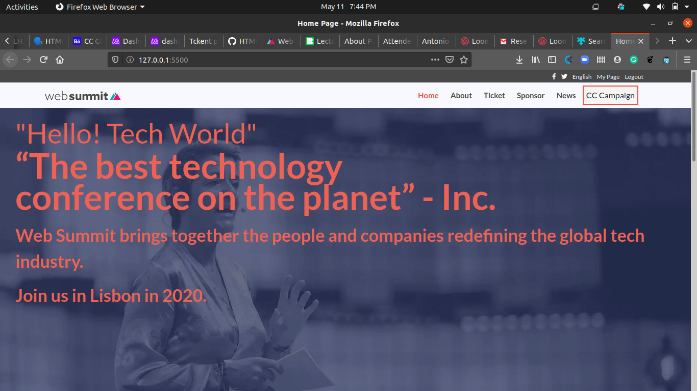

# Newsweek clone
Clone of Newsweek.com web page for study purpose

[Original site](https://www.behance.net/gallery/29845175/CC-Global-Summit-2015)

> This is an assigment for Microverse HTML and CSS course. The goal is to clone the Newsweek.com page with static functionability.

Additional description about the project and its features.

## Built With

- HTML,
- CSS,
- Bootstrap

## Live Demo

[Live Demo](https://raw.githack.com/chindrop/Html-CSS_Capstone/feature-branch/index.html)

## Getting Started

To get a local copy up and running follow these simple example steps.

### Prerequisites

- A compatible browser with HTML and CSS. 

### Install

- Just clone the project

### Usage

- Open the index.html file in any browser or edit using Visual Code or the preference IDE for web development

## Author

👤 **Caleb Apronti**

- Github: [@chindrop](https://github.com/chindrop)
- Twitter: [@chin_lee5](https://twitter.com/chin_lee5)
- Linkedin: [Caleb Apronti](https://www.linkedin.com/in/caleb-apronti-8b511687/)

## 🤝 Contributing

Contributions, issues and feature requests are welcome!

Feel free to check the [issues page](https://github.com/chindrop/Html-CSS_Capstone/feature-branch).

## Show your support

Give a ⭐️ if you like this project!

<!-- ACKNOWLEDGEMENTS -->

## Acknowledgements

- [Microverse](https://www.microverse.org/)
- [CreativeCommons](https://creativecommons.org/licenses/by-nc/4.0/)

## 📝 License

This project is free to use as learning purposes. For any external content (e.g. logo, images, ...), please contact the proper author and check their license of use.